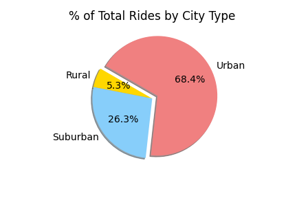

# PyBer_Analysis

## Project Overview
Pyber, a ride sharing company requires a thorough inspection of the two given data sets, city and ride data. An explanatory analysis must be performed using the Pandas library, Matplotlib, and Jupyter Notebook to visualize the provided data in order to create data driven decisions. A list of deliverables is highlighted below as per the company requirements.

1. Load, read and inspect dataset
2. Merge datasets to create a workable dataframe
3. Calculate the total rides, drivers, and the amount of fares for each city type
4. Calculate the average fare per ride for each city type
5. Calculate the average fare per driver for each city type
6. Create a Pyber Summary Dataframe
7. Plot line chart analysis from the created Pyber Dataframe to show the differences in fares per city 

## Resources
- Data Source: city_data.csv, ride_data.csv
- Software: Python 3.6.7, Anaconda 2020.11, Jupyter Notebook 6.2.0

## Results
- Rural
  - 125 rides 
  - 78 Total Drivers
  - $4,327.93 Total Fares
  - $34.62 Average Fare per Ride
  - $55.49 Average Fare per Driver 
  
- Suburban
  - 625 rides
  - 490 Total Drivers
  - $19,356.33 Total Fares
  - $30.97 Average Fare per Ride
  - $39.50 Average Fare per Driver

- Urban
  - 1,625 rides
  - 2,405 Total Drivers
  - $39,3854.38 Total Fares
  - $24.53 Average Fare per Ride
  - $16.57 Average Fare per Driver

##### Total Fare trends by City Type

Based off of the current summary and the fare trends, it is evident that the Urban market has the most number of rides while rural has the least. This is also reflected on the percentage of fares by each city type on the pie chart below. Although the urban market has the most number of rides, the rural market however has the highest average fare out of the three assuming that the passengers are travelling farther distances compared to the urban and suburban passengers. The number of drivers also reflect the demand for each city type, especially the urban market with more drivers than total rides.

## Recommendations
- The total number of drivers exceed the demand in the urban market, therefore drivers from the urban market should be moved to the rural or the suburban market. This is especially true since the rural market only takes account for 2.6% of all the drivers while  it is responsible for 6.8% of the total fares.
- With the highest average fare per city type, increase the demand within the rural market
- Determine the reason why there is a significant downtrend during the third week of February
- Include the average miles traveled per ride in the dataset to gain more insight within the differences in average fares and rides per city type
